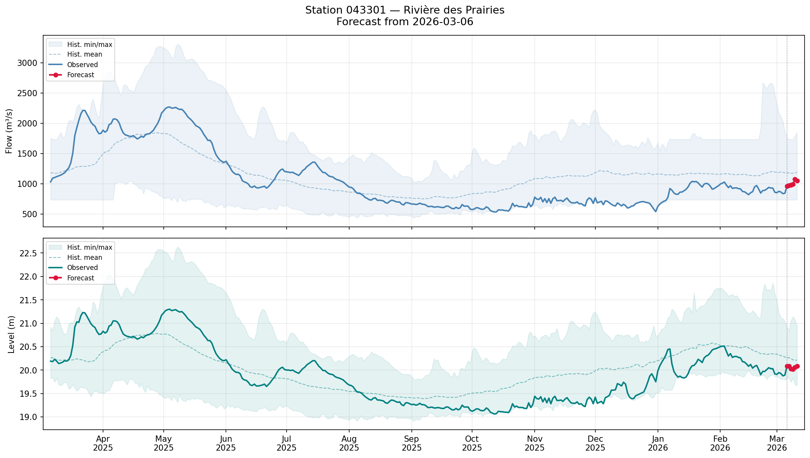

# Prévision du niveau de la station 043301

Ce projet est une simple expérimentation que j'ai créé afin de ma familiariser 
avec Claude Code. Aucune donné ni méthode utilisée ici est réputée être valide, 
fonctionnelle ni n'est réputée exacte. 

Les données de ce dépôt GitHub ainsi que celles produites par les outils ne 
peuvent pas être utilisées pour aucune fin de planification ou de décision 
par rapport au niveau de la rivière.

L'auteur se dégage de toute responsabilité face à l'utilisation par quiconque 
des données ou outils sur ce site. Le tout n'est qu'une exploration et ne sert 
qu'à discuter sur les outils et techniques explorées ici.

  -Laurent

# Rivière des Prairies — 5-Day Forecast

Daily flow (m³/s) and water level (m) forecast for CEHQ station **043301**
(Rivière des Prairies at Laval), using a LightGBM model trained on 45+ years
of hydrological and climate data.



## Results

Held-out test set (2024-02-27 → 2026-02-26, 731 days) used for evaluation.
The deployed model is retrained on the full dataset (1978-01-01 → 2026-02-26, 17,589 days).

| Horizon | Flow RMSE (m³/s) | Level RMSE (m) | Skill vs. persistence |
|---------|-----------------|----------------|-----------------------|
| t+1     | 40.1            | 0.061          | +18%                  |
| t+2     | 71.9            | 0.100          | +13%                  |
| t+3     | 97.1            | 0.135          | +12%                  |
| t+4     | 117.9           | 0.160          | +12%                  |
| t+5     | 139.8           | 0.179          | +10%                  |

## Data sources

| Source | Variables | Period |
|--------|-----------|--------|
| [CEHQ](https://www.cehq.gouv.qc.ca) | Flow (m³/s), Level (m) | 1922–present |
| [Open-Meteo ERA5](https://open-meteo.com) | Temperature, precipitation, snowfall, rain | 1940–present |
| [mghydro.com](https://mghydro.com) | Basin boundary polygon (GeoJSON) | static |

## Pipeline

```
load_data.py      CEHQ historical + live feed
load_climate.py   basin boundary (mghydro.com) → ERA5 basin-mean daily climate (Open-Meteo)
     │
     ▼
features.py       build_dataset() → (X, y)
                  • Lags 1–30 days (flow, level, climate)
                  • Rolling mean/max/std (3–30 days)
                  • Snowpack proxy (degree-day model)
                  • Seasonal encoding (sin/cos DOY)
                  • Flow anomaly vs seasonal median
     │
     ▼
model.py          10 × LGBMRegressor (one per horizon)
                  Evaluated on 2024–2026, deployed on full 1978–2026
     │
     ▼
predict.py        5-day forecast CLI
```

## Usage

```bash
# Set up environment
python -m venv .venv
source .venv/bin/activate
pip install lightgbm scikit-learn pandas numpy requests shapely pyarrow
brew install libomp   # macOS only

# Build features and train (downloads data on first run)
python src/model.py

# Forecast from latest available date
python src/predict.py

# Forecast from a specific past date (shows observed vs predicted)
python src/predict.py --date 2025-06-01
```

Example output:

```
════════════════════════════════════════════════════════════
  5-day forecast — Station 043301 (Des Prairies)
  Anchor: 2026-02-26
════════════════════════════════════════════════════════════
  Day    Date           Flow (m³/s)   Level (m)
  t+1    2026-02-27         923.5      47.694
  t+2    2026-02-28         932.5      47.728
  t+3    2026-03-01         931.8      47.705
  t+4    2026-03-02         949.0      47.659
  t+5    2026-03-03         938.3      47.681

  Observed on 2026-02-26: flow = 927.2 m³/s, level = 47.650 m
════════════════════════════════════════════════════════════
```

## Model details

- **Strategy:** direct multi-output — one `LGBMRegressor` per horizon (t+1…t+5),
  separately for flow and level
- **Training period:** 1978-01-01 onward (post-dam era)
- **Features:** ~82 columns — lags, rolling statistics, snowpack proxy,
  seasonal encoding, flow anomaly
- **Hyperparameters:** 500 trees, lr=0.05, 63 leaves, subsample=0.8
- **Top features:** current flow, 3-day rolling max flow, current level,
  day-of-year (sin), 30-day mean temperature
