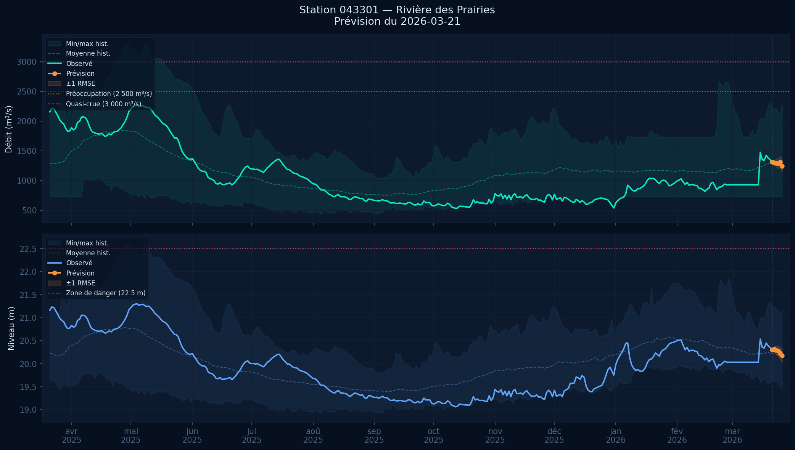
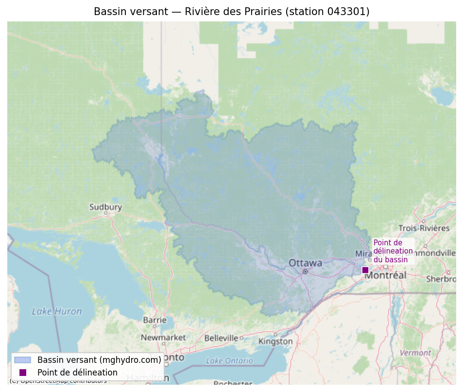
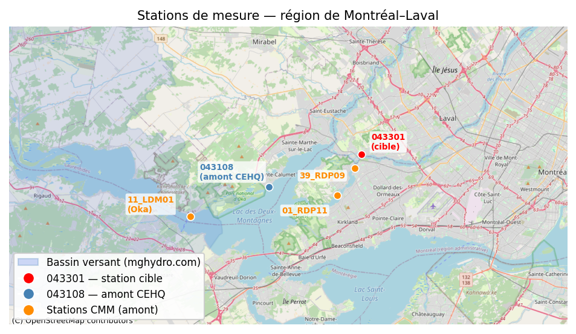

# Prévision du niveau de la station 043301

Ce projet est une simple expérimentation que j'ai créé afin de ma familiariser
avec Claude Code. Aucune donnée ni méthode utilisée ici n'est réputée être valide,
fonctionnelle ni exacte.

Les données de ce dépôt GitHub ainsi que celles produites par les outils ne
peuvent pas être utilisées pour aucune fin de planification ou de décision
par rapport au niveau de la rivière.

L'auteur se dégage de toute responsabilité face à l'utilisation par quiconque
des données ou outils sur ce site. Le tout n'est qu'une exploration et ne sert
qu'à discuter des outils et techniques explorés ici.

  -Laurent

# Rivière des Prairies — Prévision sur 5 jours

Prévision quotidienne du débit (m³/s) et du niveau d'eau (m) pour la station CEHQ **043301**
(Rivière des Prairies à Laval), à l'aide d'un modèle LightGBM entraîné sur plus de 45 ans
de données hydrologiques et climatiques, avec injection de la prévision météo et des conditions
hydrologiques en amont en temps réel.



La prévision la plus récente est également disponible en JSON lisible par machine : [`docs/forecast.json`](docs/forecast.json)

## Modèles déployés

Trois modèles tournent en parallèle à chaque cycle de prévision, chacun produisant son propre jeu de fichiers.

| Modèle | Fichiers de sortie | Rôle |
|--------|-------------------|------|
| **Quantile CV-tuné** (production) | `forecast.*` | Optimisé pour la détection des crues — biaise les prédictions vers le haut |
| MSE saisonnier | `forecast_mse.*` | Référence régression standard — bon pour les conditions normales |
| Ext10 MSE | `forecast_ext10.*` | Variante MSE avec prévision météo étendue jusqu'à t+10 |

### Modèle de production — régression par quantile (α=0,85)

Le modèle de production utilise la régression par quantile LightGBM plutôt que la régression MSE classique. Les prédictions sont biaisées vers le haut sous l'incertitude : la sous-prédiction est pénalisée 85 % du temps. Les hyperparamètres ont été optimisés en minimisant la perte pinball sur les jours où le débit dépasse 1 500 m³/s (approche d'une crue), avec des plis CV 2020–2023 et les années 2017 et 2019 réservées pour l'évaluation finale.

**Pourquoi pas le MSE ?** L'ensemble de test 2024–2026 ne contient aucun jour de crue (max : 2 269 m³/s). Le RMSE sur ces deux années ne mesure pas ce qui importe. Sur l'ensemble complet des données, seuls 145 des 9 490 jours de saison froide (1,5 %) dépassent le seuil de préoccupation de 2 500 m³/s. Un modèle MSE apprend à prédire les conditions normales avec précision mais rate les montées de crue.

**Résultats détection de crue** — évaluation walk-forward hors-échantillon sur les années de crue 2017, 2019, 2023 (seuil : 2 500 m³/s) :

| Horizon | Rappel — MSE | Rappel — quantile CV | Précision — quantile CV |
|---------|-------------|---------------------|------------------------|
| t+1 | 0,935 | 0,989 | ≥ 0,876 |
| t+3 | 0,828 | 0,946 | ≥ 0,876 |
| t+5 | 0,656 | 0,839 | ≥ 0,876 |

Le modèle quantile CV donne également 1–2 jours d'avertissement avancé pour les premières montées de 2017 et 2019, contre zéro pour le modèle MSE.

Le fichier `forecast.json` inclut un bloc `flood_risk` avec deux indicateurs booléens :
- `concern` : au moins un horizon prédit dépasse 2 500 m³/s
- `near_flood` : au moins un horizon prédit dépasse 3 000 m³/s

### Modèles de référence

- **`forecast_mse`** — le modèle MSE saisonnier qui était en production avant le passage au quantile. Utile comme référence pour la précision en conditions normales. Les tables RMSE ci-dessous reflètent ce modèle.
- **`forecast_ext10`** — variante MSE entraînée avec la prévision météo étendue jusqu'à t+10 (contre t+5). Permet au modèle de capter un signal météorologique plus lointain.

## Bassin versant et stations



Le bassin versant est délinéé par [mghydro.com](https://mghydro.com) à partir du point d'exutoire (région d'Ottawa). Les données météo ERA5 et la prévision Open-Meteo sont moyennées sur l'ensemble de ce bassin.



Les sept stations de mesure utilisées en entrée du modèle, de la région d'Ottawa jusqu'à Laval.

## Résultats (modèle de référence MSE)

RMSE sur l'ensemble de test retenu (2024-03-10 → 2026-03-09, 730 jours). Ces chiffres reflètent le modèle MSE saisonnier — pas la cible d'optimisation du modèle de production (voir résultats de détection de crue ci-dessus). Les modèles déployés sont ré-entraînés sur l'ensemble complet des données (1978-01-01 → 2026-03-09).

Deux modèles saisonniers distincts : **froid** (nov–mai, fonte des neiges / crue printanière) et **chaud** (juin–oct, pluie / étiage).

### Saison froide (nov–mai)

| Horizon | RMSE débit (m³/s) | RMSE niveau (m) | Gain vs. persistance |
|---------|-------------------|-----------------|----------------------|
| t+1     | 36,2              | 0,054           | +26 %                |
| t+2     | 55,4              | 0,081           | +33 %                |
| t+3     | 74,8              | 0,102           | +34 %                |
| t+4     | 94,5              | 0,120           | +33 %                |
| t+5     | 104,3             | 0,136           | +37 %                |

### Saison chaude (juin–oct)

| Horizon | RMSE débit (m³/s) | RMSE niveau (m) | Gain vs. persistance |
|---------|-------------------|-----------------|----------------------|
| t+1     | 30,9              | 0,040           | +38 %                |
| t+2     | 55,2              | 0,072           | +35 %                |
| t+3     | 74,2              | 0,095           | +33 %                |
| t+4     | 89,2              | 0,111           | +31 %                |
| t+5     | 98,0              | 0,123           | +33 %                |

## Sources de données

| Source | Variables | Période |
|--------|-----------|---------|
| [CEHQ](https://www.cehq.gouv.qc.ca) | Débit (m³/s), Niveau (m) — station 043301 | 1922–présent |
| [CEHQ](https://www.cehq.gouv.qc.ca) | Niveau amont (m) — station 043108 (Lac des Deux Montagnes) | 1986–présent |
| [ECCC / HYDAT](https://eau.ec.gc.ca) | Débit (m³/s) — station 02KF005 (rivière des Outaouais à Britannia) | 1960–présent |
| [ECCC / HYDAT](https://eau.ec.gc.ca) | Niveau (m) — station 02LA015 (rivière des Outaouais à Hull) | 1964–présent |
| [Open-Meteo ERA5](https://open-meteo.com) | Température, précipitations, chutes de neige, pluie (observé) | 1940–présent |
| [Open-Meteo Forecast](https://open-meteo.com) | Prévision météo sur 5 jours (température, précipitations, pluie, neige) | temps réel |
| [mghydro.com](https://mghydro.com/app/report?lat=45.454&lng=-74.106&precision=low&simplify=true) | Polygone du bassin versant (GeoJSON) — ID M72047806, ~148 202 km² | statique |

> **Note :** Les données [Crues Grand Montréal](https://www.cruesgrandmontreal.ca) (stations 39_RDP09, 01_RDP11, 11_LDM01) sont désactivées en attente de l'historique pluriannuel.

### Stations hydrologiques amont

| Station | Source | Localisation | Dist. amont | Variable |
|---------|--------|-------------|-------------|----------|
| 043108 | CEHQ | Lac des Deux Montagnes | ~22 km | Niveau (m) |
| 02LA015 | ECCC | Rivière des Outaouais à Hull | ~50 km | Niveau (m) |
| 02KF005 | ECCC | Rivière des Outaouais à Britannia | ~100 km | Débit (m³/s) |

## Pipeline

```
load_data.py      Données historiques CEHQ (043301 + 043108) + ECCC (02KF005 + 02LA015)
                  Format HYDAT CSV + exports XML temps réel → chargés via glob
load_climate.py   Bassin versant (mghydro.com) → Climat journalier moyen ERA5 (Open-Meteo)
load_forecast.py  Prévision météo 5 jours (Open-Meteo) → injectée à l'inférence
     │
     ▼
features.py       build_dataset() → (X, y)   [165 colonnes]
                  • Décalages 1–30 jours (débit, niveau, amont 043108, Outaouais 02KF005 +
                    02LA015, climat, profondeur de neige ERA5-Land)
                  • Moyenne/max/écart-type glissants (3–30 jours)
                  • Proxy d'enneigement (modèle degré-jour)
                  • Encodage saisonnier (sin/cos jour de l'année)
                  • Anomalie de débit vs médiane saisonnière
                  • Prévision météo t+1…t+5 (proxy ERA5 à l'entraînement,
                    prévision réelle Open-Meteo à l'inférence)
     │
     ▼
model.py          2 ensembles saisonniers × 10 LGBMRegressor (un par horizon)
                  Froid : nov–mai (fonte des neiges, crue printanière)
                  Chaud : juin–oct (pluie, étiage)
                  Évalué sur 2024-03-10 → 2026-03-09, déployé sur l'ensemble 1978–2026
     │
     ▼
predict.py        Interface CLI de prévision 5 jours → docs/forecast.png + docs/forecast_30d.png
                  + docs/forecast.json
                  Sélectionne automatiquement le modèle saisonnier selon la date d'ancrage
```

## Utilisation

```bash
# Configurer l'environnement
python -m venv .venv
source .venv/bin/activate
pip install lightgbm scikit-learn pandas numpy requests shapely pyarrow
brew install libomp   # macOS seulement

# Construire les caractéristiques et entraîner le modèle (télécharge les données au premier lancement)
python src/model.py

# Prévision à partir de la dernière date disponible
python src/predict.py

# Prévision à partir d'une date passée (affiche les valeurs observées vs prédites)
python src/predict.py --date 2025-06-01
```

## Détails du modèle

- **Stratégie :** multi-sortie directe — un `LGBMRegressor` par horizon (t+1…t+5),
  séparément pour le débit et le niveau, avec deux ensembles saisonniers (froid / chaud)
- **Sélection saisonnière :** froid = nov–mai, chaud = juin–oct ; `predict.py` choisit
  automatiquement l'ensemble selon la date d'ancrage via `season_for()`
- **Période d'entraînement :** à partir du 1978-01-01 (ère post-barrage)
- **Caractéristiques :** 165 colonnes — décalages, statistiques glissantes (stations 043108,
  02KF005 Outaouais à Britannia, 02LA015 Outaouais à Hull), profondeur de neige ERA5-Land,
  proxy d'enneigement, encodage saisonnier, anomalie de débit, prévision météo 5 jours
- **Modèle de production :** régression par quantile α=0,85, hyperparamètres optimisés par
  CV event-focused (perte pinball sur jours > 1 500 m³/s, plis 2020–2023)
- **Hyperparamètres MSE/Ext10 :** 500 arbres, lr=0,05, 63 feuilles, subsample=0,8
- **Meilleures caractéristiques (froid) :** débit actuel, max glissant 3 j, niveau actuel,
  jour de l'année (sin), précipitations cumulées prévues 5 j
- **Meilleures caractéristiques (chaud) :** débit actuel, niveau Hull (02LA015),
  max glissant 3 j, niveau actuel, anomalie de débit

---

*[English version](README_EN.md)*
